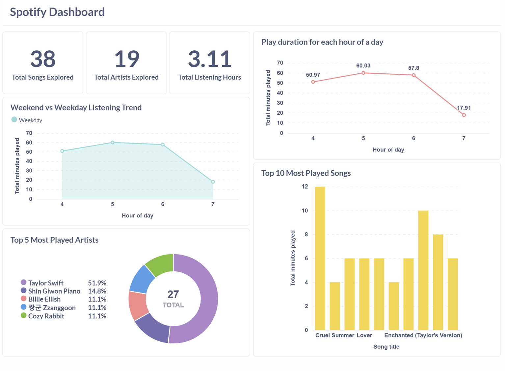

# Spotify ETL Pipeline

Designed and implemented a Spotify ETL pipeline using Airflow, MinIO, Postgres, and Metabase. Built a recommendation engine on top of structured data to suggest new tracks, demonstrating skills in data orchestration, data warehousing, and analytics engineering.

**Note:** This project is a work in progress and not yet complete.

## Overview

- **Apache Airflow** → Workflow orchestration and scheduling of ETL jobs
- **MinIO** → Object storage for raw JSON data and backups
- **PostgreSQL** → Central data warehouse for transformed data
- **Metabase** → Interactive dashboards for data visualization and insights
- **Docker Compose** → Containerized deployment of all services
- **Recommendation Engine** → Suggests new tracks based on recent plays and audio features (`SpotifyFeatures.csv`)

---

## Project Structure

```
spotify-etl-pipeline/
│── assets/                 # Documentation & diagrams
│── dags/                   # Airflow DAGs
│   └── recently_played_dag.py
│── data/                   # Raw data (SpotifyFeatures.csv)
│── database/               # Database setup scripts
│   ├── create_db.sql
│   ├── schema.sql
│── etl/                    # ETL scripts
│── logs/                   # Airflow & ETL logs
│── metabase/               # Dashboard queries
│── recommendations/        # Recommender system
│── config.py               # Main config
│── docker-compose.yml      # Service orchestration
│── Dockerfile              # Custom ETL/Airflow image
│── example.env             # Template env variables
│── .gitignore
│── README.md               # Documentation
```

---

## Architecture


## Components

**Spotify API (Source)**

- Provides listening history via the `recently-played` endpoint.
- Metadata (track, artist, album) is enriched with audio features from the API or `SpotifyFeatures.csv`.

**Apache Airflow (Orchestration)**

- DAGs manage ETL jobs: **Extract → Transform → Load**.
- Scheduled runs ensure data freshness.
- Integrated logging and monitoring.

**ETL Layer**

- **Extract** – Fetch Spotify data and save raw CSV in **MinIO**.
- **Transform** – Clean and normalize data; save Parquet in **MinIO**.
- **Load (Processed)**: Save processed data as Parquet in MinIO and load into PostgreSQL tables:
  - `dim_artist`
  - `dim_song`
  - `dim_date`
  - `fact_play_summary`

**PostgreSQL (Data Warehouse)**

- Central store for structured and queryable data.
- Optimized schema for analytics and recommendation queries.

**MinIO (Object Storage)**

- Stores raw JSON/CSV dumps and processed Parquet files.
- Ensures replayability, recovery, and reproducibility.

**Metabase (Visualization)**

- Dashboards for listening trends, top artists, and weekday/weekend patterns.
- Enables business intelligence queries without writing SQL.

**Recommendation Engine**

- Python-based content filtering engine.
- Uses audio features + listening history to suggest similar songs.
- Can integrate with dashboards or be exposed via API.

## Pipeline Steps

**Extract** – Fetch Spotify data and save raw CSV in **MinIO**.  
**Transform** – Clean and normalize data; save Parquet in **MinIO**.  
**Load** – Load processed Parquet into **PostgreSQL** (`dim_artist`, `dim_song`, `dim_date`, `fact_play_summary`).  
**Visualize** – Explore data with **Metabase**.  
**Recommend** – Suggest tracks using audio features and listening history.

## Table Descriptions

### Dimensions

| Table      | Columns                                              | Description                                |
| ---------- | ---------------------------------------------------- | ------------------------------------------ |
| dim_artist | artist_key (PK), artist_id, artist_name              | Stores unique artists.                     |
| dim_song   | song_key (PK), song_id, song_title, song_duration_ms | Stores unique songs and their duration.    |
| dim_date   | date_key (PK), year, month, hour_of_day, day_of_week | Stores date and time attributes for plays. |

### Fact

| Table             | Columns                                                                                               | Description                                            |
| ----------------- | ----------------------------------------------------------------------------------------------------- | ------------------------------------------------------ |
| fact_play_summary | play_id (PK), song_key (FK), artist_key (FK), date_key (FK), play_count, total_duration_ms, played_at | Stores play events, linking songs, artists, and dates. |

---

<!-- ## Setup

### 1️ Clone

```bash
git clone https://github.com/thuythanh04/spotify-etl-pipeline.git
cd spotify-etl-pipeline
```

### 2 Configure Environment

```bash
cp example.env .env
```

Fill in:

- Spotify API credentials
- Postgres connection
- Metabase configs -->

## 📊 Dashboards

Metabase visualizes:


---

## Recommendations (Work in Progress)
