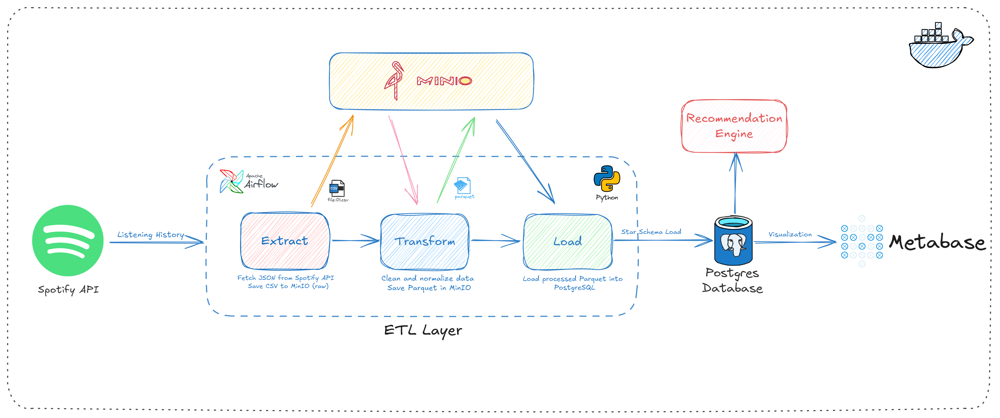
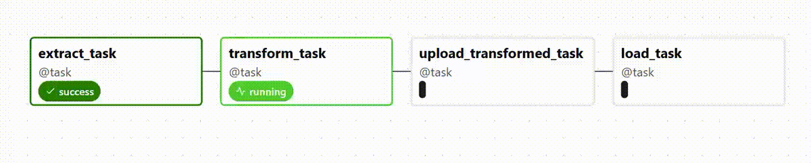
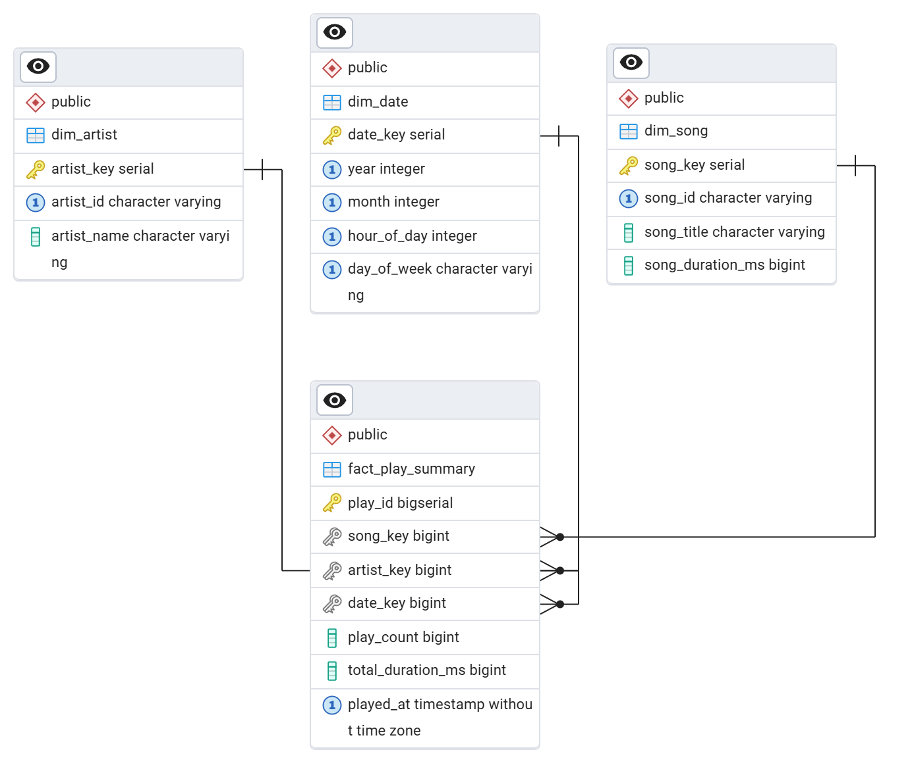
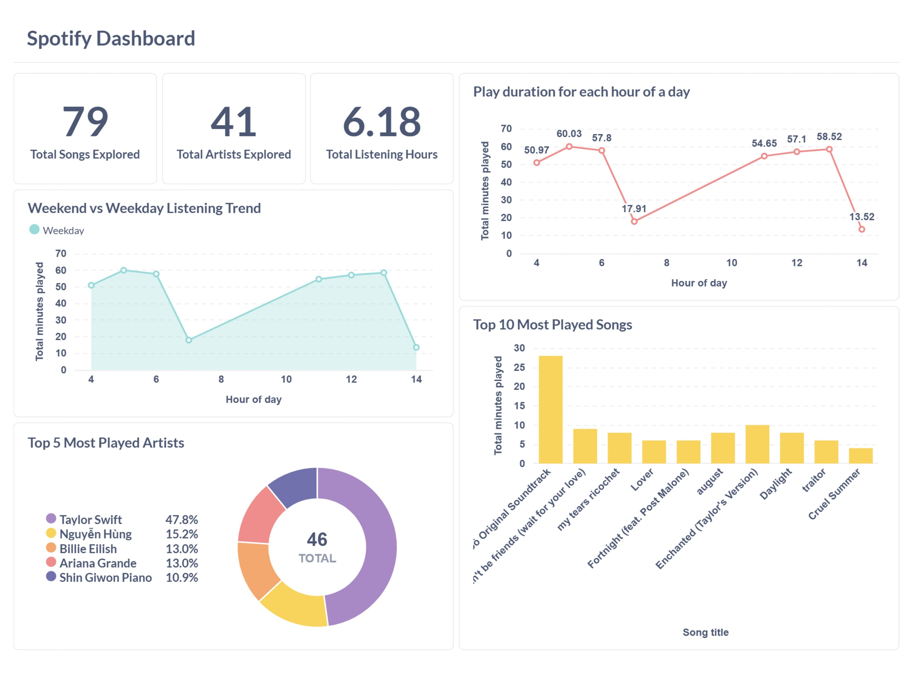
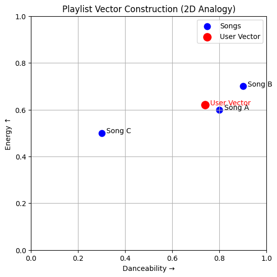
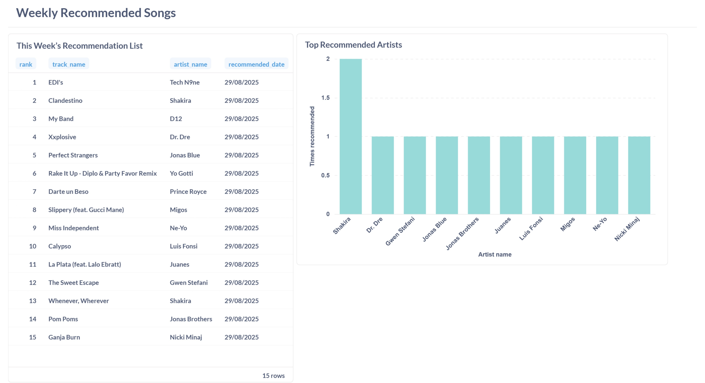

# Spotify ETL Pipeline

Designed and implemented a Spotify ETL pipeline using Airflow, MinIO, Postgres, and Metabase. Built a recommendation engine on top of structured data to suggest new tracks, demonstrating skills in data orchestration, data warehousing, and analytics engineering.

## Overview

- **Apache Airflow** → Workflow orchestration and scheduling of ETL jobs
- **MinIO** → Object storage for raw JSON data and backups
- **PostgreSQL** → Central data warehouse for transformed data
- **Metabase** → Interactive dashboards for data visualization and insights
- **Docker Compose** → Containerized deployment of all services
- **Recommendation Engine** → Suggests new tracks based on recent plays and audio features (`SpotifyFeatures.csv`)

---

## Project Structure

```
spotify-etl-pipeline/
│── assets/                 # Documentation & diagrams
│── dags/                   # Airflow DAGs
│   └── recently_played_dag.py
│── data/                   # Raw data (SpotifyFeatures.csv)
│── database/               # Database setup scripts
│   ├── create_db.sql
│   ├── schema.sql
│── etl/                    # ETL scripts
│── logs/                   # Airflow & ETL logs
│── metabase/               # Dashboard queries
│── recommendations/        # Recommender system
│── config.py               # Main config
│── docker-compose.yml      # Service orchestration
│── Dockerfile              # Custom ETL/Airflow image
│── example.env             # Template env variables
│── .gitignore
│── README.md               # Documentation
```

---

## Architecture



## Components

**Spotify API (Source)**

- Provides listening history via the `recently-played` endpoint.
- Metadata (track, artist, album) is enriched with audio features from the API or `SpotifyFeatures.csv`.

**Apache Airflow (Orchestration)**

- DAGs manage ETL jobs: **Extract → Transform → Load**.
- Scheduled runs ensure data freshness.
- Integrated logging and monitoring.
- Example DAG screenshot:
  

**ETL Layer**

- **Extract** – Fetch Spotify data and save raw JSON in **MinIO**.
- **Transform** – Clean and normalize data; save Parquet in **MinIO**.
- **Load (Processed)**: Load processed data as Parquet in MinIO into PostgreSQL tables:
  - `dim_artist`
  - `dim_song`
  - `dim_date`
  - `fact_play_summary`

**PostgreSQL (Data Warehouse)**

- Central store for structured and queryable data.
- Optimized schema for analytics and recommendation queries.

**MinIO (Object Storage)**

- Stores raw JSON dumps and processed Parquet files.
- Ensures replayability, recovery, and reproducibility.

**Metabase (Visualization)**

- Dashboards for listening trends, top artists, and weekday/weekend patterns.
- Enables business intelligence queries without writing SQL.

**Recommendation Engine**

- Python-based content filtering engine.
- Uses audio features + listening history to suggest similar songs.
- Can integrate with dashboards or be exposed via API.

## Pipeline Steps

**Extract** – Fetch Spotify data and save raw JSON in **MinIO**.  
**Transform** – Clean and normalize data; save Parquet in **MinIO**.  
**Load** – Load processed Parquet into **PostgreSQL** (`dim_artist`, `dim_song`, `dim_date`, `fact_play_summary`).  
**Visualize** – Explore data with **Metabase**.  
**Recommend** – Suggest tracks using audio features and listening history.

## Table Descriptions



### Dimensions

| Table      | Columns                                                   | Description                                |
| ---------- | --------------------------------------------------------- | ------------------------------------------ |
| dim_artist | artist_key (PK), artist_id, artist_name                   | Stores unique artists.                     |
| dim_song   | song_key (PK), song_id, song_title, song_duration_ms      | Stores unique songs and their duration.    |
| dim_date   | date_key (PK), year, month, day, hour_of_day, day_of_week | Stores date and time attributes for plays. |

### Fact

| Table             | Columns                                                                                               | Description                                            |
| ----------------- | ----------------------------------------------------------------------------------------------------- | ------------------------------------------------------ |
| fact_play_summary | play_id (PK), song_key (FK), artist_key (FK), date_key (FK), play_count, total_duration_ms, played_at | Stores play events, linking songs, artists, and dates. |

---

## Setup

### 1️ Clone

```bash
git clone https://github.com/thuythanh04/spotify-etl-pipeline.git
cd spotify-etl-pipeline
```

### 2 Install Dependencies

```bash
pip install -r requirements.txt
```

### 3 Configure Environment

```bash
cp example.env .env
```

Fill in:

- Spotify API credentials
- Postgres connection
- Metabase/ Airflow configs

### 4 Build images and run the services.

```bash
  make build
  make up
```

### 5 Access the Services

Airflow Webserver → http://localhost:8080

Metabase → http://localhost:3008

PgAdmin → http://localhost:8082

MinIO Console → http://localhost:9001

## 📊 Dashboards

Metabase visualizes:

Some dashboard views, such as the weekend vs weekday trend, are incomplete due to insufficient weekend data.

---

## Recommendations

The recommendation engine is an extension of the ETL pipeline that suggests new tracks based on recent listening history and track-level audio features.

## Features

- Extract recent listening history from **Spotify API** (`recently_played` endpoint).
- Enrich tracks with **Spotify audio features** (energy, valence, tempo, etc.).
- Construct a **taste profile** using recent plays with **recency weighting**.
- Recommend **Top N new songs** most similar to the playlist profile.
- Store results in a dedicated table (`recommendation_list`) for dashboards.
- Visualize weekly recommendation charts in **Metabase**.

## Design

### 1. Input Data Sources

- **Spotify API (`recently_played`)** → recent tracks for the user.
- **SpotifyFeatures.csv** (static dataset) → track metadata.

#### Dataset Structure (SpotifyFeatures.csv)

- **Identifiers**: `track_id`, `track_name`, `artist_name`, `genre`, `popularity`
- **Audio Features**: `acousticness`, `danceability`, `energy`, `valence`, `tempo`, `duration_ms`, `loudness`, `instrumentalness`, `speechiness`, `liveness`, `key`, `mode`, `time_signature`

---

### 2. Feature Engineering

- **Numerical features**:  
  `danceability`, `energy`, `loudness`, `speechiness`, `acousticness`,  
  `instrumentalness`, `liveness`, `valence`, `tempo`, `duration_ms`.

- **Categorical features**:  
  `key`, `genre` → transformed via one-hot encoding.

- **Normalization**: all features scaled (MinMaxScaler) for fair similarity comparisons.

---

### 3. Recency Weighting

We apply an exponential decay so that recently played songs have more influence:

            weight = exp(- Δt / τ)

- Δt = time since track was played
- τ = decay constant (e.g., 7 days)

```python
# Exponential decay weights by recency (τ = 1 day in this example)
playlist_df["weight"] = np.exp(
    -(now - playlist_df["played_at"]).dt.total_seconds() / (3600 * 24)
)
```

---

### 4. Playlist Vector Construction

- Each song = high-dimensional **feature vector**.
- User’s **taste profile** = weighted average of recent plays.

---

### 5. Similarity Computation

- Compute **cosine similarity** between playlist vector and candidate tracks.
- Exclude tracks already in the recent history.
- Rank songs by similarity score.

Playlist Vector Example:



- Recommendations = find songs closest to User Vetor.

---

### 6. Output

- **Top N recommended songs** (e.g., 10–20).
- Stored in **PostgreSQL table**: `recommendation_list`.
- Integrated into **Metabase dashboards** for visualization.

---

## 📈 Example Flow

1. User plays **Song A, Song B, Song C**.
2. Extract their **audio features**.
3. Compute **playlist vector** (weighted by recency).
4. Compare playlist vector to all songs in `SpotifyFeatures.csv`.
5. Recommend **new songs** closest in cosine similarity.

### Table: recommendation_list

| Column         | Type      | Description                                |
| -------------- | --------- | ------------------------------------------ |
| rec_id (PK)    | SERIAL    | Unique recommendation ID                   |
| track_name     | TEXT      | Recommended track name                     |
| artist_name    | TEXT      | Recommended artist name                    |
| rank           | INT       | Position of the recommendation in the list |
| recommended_at | TIMESTAMP | Timestamp when recommendation was made     |
| year           | INT       | Extracted year of recommendation           |
| week_of_year   | INT       | ISO week number of recommendation          |

---

## Weekly Recommended Songs Dashboard


